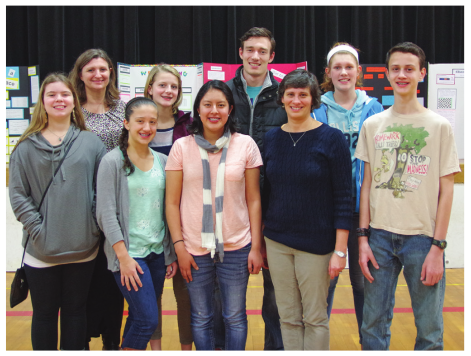

<!DOCTYPE html>
<html><head>
        <meta http-equiv="Content-Type" content="text/html; charset=UTF-8">
    </head>
    <body>
        

            <h1>Sharing their love of math</h1>
        

        
<!-- lines following  -->
        

            <table>
                <tbody><tr>
                    <td><!-- path --></td>
                    <td>
                        <i style="font-size: 13px">Quick. Look at this picture. 
                            Do you see a bunny or a 
                            duck? Turns out, your answer 
                            may hinge on your gender. </i>
                    </td>
                </tr>
            </tbody></table>
        

        

             <table border="0" cellspacing="10">
            <tbody><tr>
                <td width="50%">
                    
<i>The statistics around perceptions of optical illusions relating
to gender is anything but a typical science fair project, but
Madison Dreger, a local eighth grader, happily tackled the topic.
Dreger was one of six Yamhill-Carlton Intermediate
School (YCIS) students who worked side-by-side with six
Linfield College math majors and minors on a series of science
fair projects emphasizing mathematics.</i>
<!-- static -->

<i>
The mentoring program, in its first year, was funded by a
Mathematics Enrichment Grant from the Dolciani Foundation
and the Mathematical Association of America. The program
targets students at YCIS who are ready for more challenges in
mathematics and to encourage them to study math in high school
and beyond, according to Jennifer Nordstrom, professor of
mathematics at Linfield.</i>

<i>
“When I’ve judged science fairs in the past, the really big
difference has been access to resources,” Nordstrom said.
“For example, students may have had a parent who was a scientist
or the ability to get into a lab. That was one of the things I really
wanted to provide to the Yamhill-Carlton students – access to
computers and people who could help them. They’ve been able to
do things they wouldn’t otherwise do until college.”</i>

<i>
Lisa Jacobs, YCIS science teacher, said the project dovetails with
the district’s emphasis on Science, Technology, Engineering and
Math (STEM) curriculum. She hopes this new mathematical focus
as part of the science fair will further encourage students’ interest in
mathematics and expand their learning beyond the classroom.
“We need to get kids STEM exposure because those are the
positions of the future,” she said. “If they’re not prepared for that,
then we’re not doing our jobs.”</i>

<i>
YCIS student Grace Armstrong worked with Linfield
mentor Katie Rees ’16 to analyze the golden ratio, 1.618, a ratio
of numbers that is visually appealing, as it appears in different
genders’ faces. The ratio is said to be the basis of facial beauty and
is used to create a ‘facial mask’ that portrays ideal beauty.</i>

<i>
“I was intrigued by the idea, but I didn’t really know that
much about it,” said Armstrong. “Also, I heard a lot about it in
nature and it seemed really interesting.”
In addition to math, Armstrong learned valuable lessons
about college during her weekly sessions at Linfield.
“It’s a somewhat scary reality check, but it’s a really cool
experience to realize how close you are to getting to go to college,”
she said.</i>

<i>
Kate Gomes tackled the Fibonacci sequence, a concept
related to the golden ratio, with mentor Jennifer Moranchel ’19.
The sequence is a series of numbers where the next number is</i>

                </td>
                <td with="50%">
                    
                    
<i>Students from Linfield College and Yamhill-Carlton Intermediate School gathered
at the YCIS Science Fair in February after working together on a series of projects
emphasizing mathematics. Front row, from left, Emma Prine, Grace Armstrong,
Jennifer Moranchel ’19, Jennifer Nordstrom and Spencer Waechtler; back row, from
left, Lisa Jacobs, Katherine Gomes, Steven Holland ’16 and Madison Dreger. Not
pictured, Phoenix Elliott, Katie Rees ’16, Katelin Swanson ’18, Michael Metter ’16
and Heather Germaine ’15.</i>

<i>found by adding up the two numbers before it. After working
with many sequences using different starting numbers, they
found that “any ratio of consecutive terms, if you use that
same recursion, will go towards the golden ratio,” Gomes said.
“Math just clicks for me. I like the solving part and discovering
something for yourself.”</i>

<i>
Other students explored checkers strategies using statistics,
the physics of wireless bungee jumping and the physics of kicking
soccer balls. The intermediate students made weekly visits to
the Linfield Campus to research these topics and prepare for the
February science fair at YCIS. Armstrong, Madison and Gomes
moved on to the NWSE state fair at Liberty High School, where
Armstrong won second place and Gomes won first place in the
math category.</i>

<i>
In addition to Moranchel and Rees, Linfield mentors included
Heather Germaine ’15, Steven Holland ’16, Michael Metter ’16 and
Katelin Swanson ’18. The Linfield mentors gained just as much
from this experience as the science fair participants did.
“I have a number of younger siblings and I’ve always enjoyed
helping them out with school,” Holland said. “I thought this
would be a great way for me to help some students.”</i>

<i>
“I have had great teachers and professors that have influenced
me, and I hope to one day be someone like them and be able to
influence kids like they’ve influenced me,” Moranchel said.</i>

<i>– Natalie Kelley ’18</i>

<data>
    
<i>See a slideshow of photos, linfield.edu/photogallery</i>

</data>
                </td>
            </tr>
        </tbody></table>
        

</body></html>
